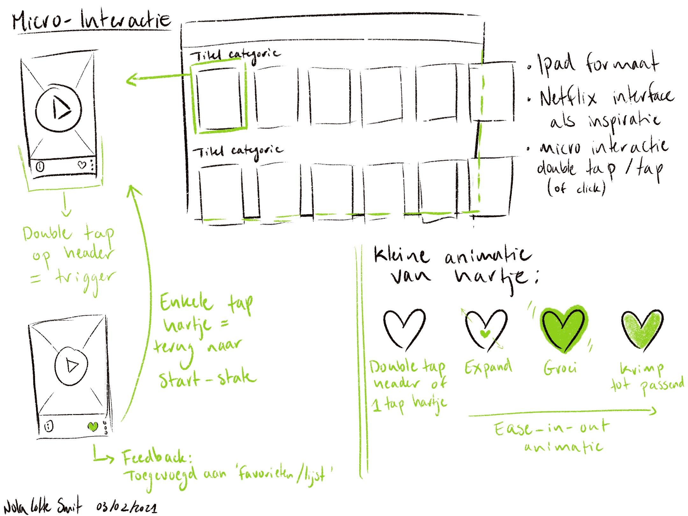
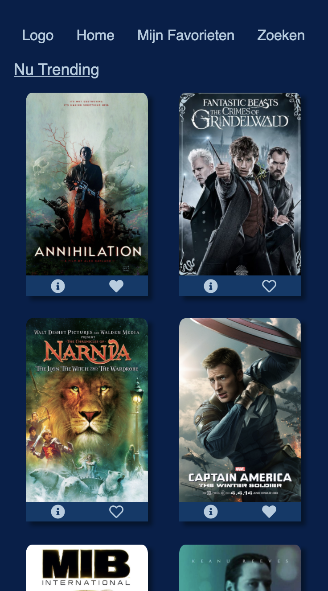
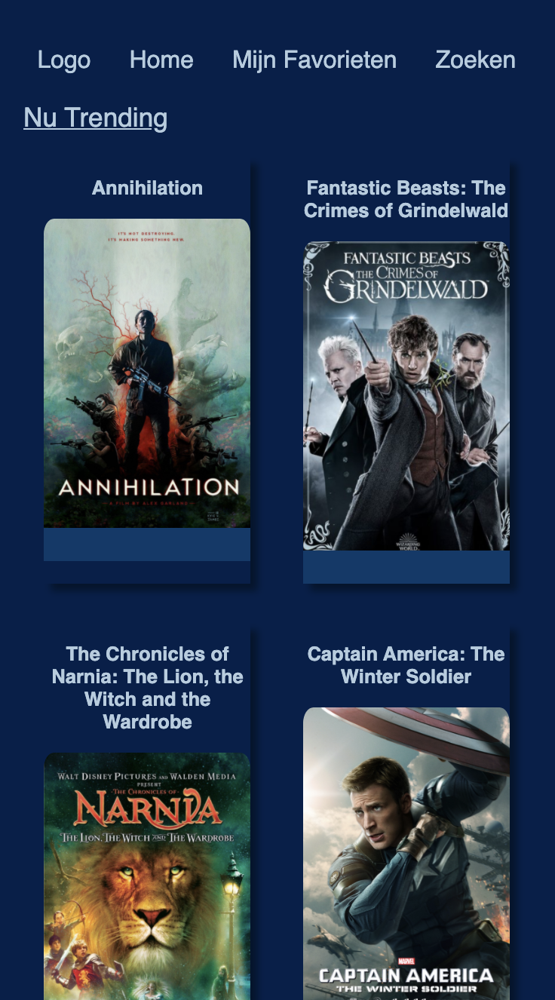

# Frontend voor Designers - opdracht 1: Een Micro-interactie uitwerken en testen
Ontwerp een user interface voor een gegeven use case. Werk je ontwerp uit in HTML, CSS en Javascript om te kunnen testen in een browser.
Lees hier de [opdrachtbeschrijving](./opdrachtbeschrijving.md).

# Film Toevoegen aan Favorieten
Ik heb een prototype van een mobiele streaming site gecodeerd. Op de web-page heb je een overzicht van populaire films. Deze films kan je toevoegen aan je favorieten door op het hartje te klikken.
Link naar demo: https://nolasmit.github.io/frontend-voor-designers-2021/opdracht1/demo/

## interface
Eerste schets:

 Bij de eerste schets was ik wat enthousiast. Ik heb het formaat veranderd naar iPhone 6/7/8 en besloot toch voor een enkele klik op het hartje te gaan.

 Versie 1:
 
 

 In de eerste versie heb ik na de eerste proces-voortgang check de JavaScript werkend gekregen. Alle hartjes zijn klikbaar. 

 Process:
 

 Ik heb geprobeerd titels toe te voegen. Dit maakte een puinhoop van mijn code en de icons leken niet meer in te laden. Ik heb besloten uiteindelijk besloten om de titels weg te laten aangezien deze ook in de hero-images stonden. De focus was dan ook de micro-intereactie en de films leken nu duidelijk genoeg.

Versie 2:
Aangezien mijn code stuk is gegaan besloot ik weer naar versie 1 te gaan. De icons werden niet meer ingeladen dus kon ik niet meer aan mijn code werken. Anders had ik graag de aangeklikte hartjes oranje gemaakt zodat ze nog beter contrasteren met het blauw. 

Leg de interface uit. In de demo heb je de interface design principles 04 & 11 van [Principles of User Interface Design](http://bokardo.com/principles-of-user-interface-design/) toegepast. Hoe heb je dat gedaan?

# Toegepaste Interface Design Principles

Principle 4: Keep users in control. Mensen voelen zich het meeste op hun gemak wanneer zij controle hebben over de situatie. Ik heb dit principe toegepast door de mensen zelf op de hartjes te laten klikken om ze toe te voegen aan favorieten, en er een tweede keer op te klikken om ze weer weg te halen. Zo hebben ze zelf controle over hun favorieten lijst.

Principle 11: Strong visual hierarchies work best. Ik heb visuele hierachie toegepast door de titel van de pagina, nu trending, groter te maken dan de nav elementen en te onderstrepen. Zo weet de gebruiker in welk deel van de website ze nu zitten.
Door de hartjes en de info button heel licht blauw te maken steken ze sterk af tegen de donkere achtergrond. Zo wordt de aandacht hier naartoe getrokken en hoeft de gebruiker hier niet lang naar te zoeken. Ook zijn deze icons even groot en staan ze op dezelfde hoogte omdat ze even belangrijk zijn. Verder heb ik het design overzichtelijk gehouden door twee films naast elkaar te zetten en dan in kolommen naar beneden te laten gaan. Zo wordt de gebruiker niet overspoeld door keuzes maar kan hij er rustig doorheen scrollen.

## code
Leg de code uit.
